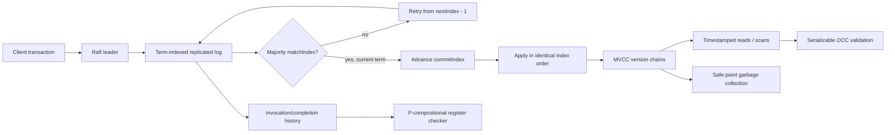

# raft-mvcc

**A deterministic C++17 laboratory for the two correctness boundaries inside a
distributed database: Raft consensus and multi-version concurrency control.**

This repository is intentionally not a wrapper around an existing consensus
library. It implements leader election, log replication, conflicting-log
repair, majority commit, replicated state-machine application, snapshot reads,
atomic MVCC batches, serializable optimistic validation, garbage collection,
and an offline linearizability checker from first principles.

The design goal is evidence, not a distributed-systems costume. Every benchmark
is labeled as an in-process simulator measurement. Every safety claim maps to a
test or an explicit invariant. Network sockets, disk persistence, snapshots,
and membership changes are listed as missing instead of being implied.

## Measured result

On an Apple M2 Pro, Apple Clang 17, macOS arm64:

| Experiment | Result | What it measures |
|---|---:|---|
| 3-node replicated writes | **~0.69M ops/s** | median-of-five in-memory message delivery and apply |
| 5-node replicated writes | **~0.35M ops/s** | median-of-five with additional quorum/message fan-out |
| MVCC point reads | **~10.3M reads/s** | median-of-five lookup across 10,000 retained versions |
| 5-node failover | **11 logical ticks** | election after isolating the leader |
| Correctness suite | **598 assertions** | 13 targeted and randomized tests |

These are not production-network throughput numbers. There is no socket,
serialization, fsync, batching, or scheduler overhead in this simulator. The
useful comparison is internal: additional replicas reduce sequential proposal
throughput through quorum and message fan-out, while the state-machine
semantics and test suite remain unchanged.

Reproduce the exact commands:

```bash
make test
make benchmark
make sanitize
```

## Architecture



The `Cluster` is a deterministic transport. It can isolate a node, create a
bidirectional partition, drop messages, heal the network, and drive logical
time. Because delivery is deterministic, every failure is reproducible without
sleeping, relying on wall-clock timing, or hoping a race appears.

## What is implemented

### Raft replicated log

- follower, candidate, and leader roles;
- randomized election deadlines derived deterministically from node ID and
  term;
- one vote per term and Raft's last-term/last-index freshness rule;
- `AppendEntries` consistency checks against `prevLogIndex` and `prevLogTerm`;
- suffix truncation when a higher-term leader exposes a conflicting entry;
- leader-side `nextIndex` backtracking and `matchIndex` tracking;
- majority commit with the **current-term-only** advancement rule;
- commit-index propagation through heartbeats;
- leadership no-op entries;
- majority and minority partition behavior;
- deterministic leader isolation, re-election, healing, and convergence.

The implementation retains a sentinel entry at index zero. Therefore the vector
offset, Raft log index, `nextIndex`, `matchIndex`, and `commitIndex` all share
one coordinate system. That removes a surprisingly common source of
off-by-one safety defects.

### MVCC state machine

Each key owns an ordered chain of immutable versions:

```text
key -> [(timestamp, transaction_id, value|tombstone), ...]
```

The store supports:

- point-in-time reads using the newest version at or below a timestamp;
- ordered range scans over one consistent snapshot;
- atomic multi-key commands replicated as one Raft log entry;
- tombstones rather than destructive deletes;
- idempotent re-application of an identical version;
- detection of conflicting values at the same timestamp;
- out-of-order version insertion for recovery/import testing;
- safe-point garbage collection that retains the anchor version required by
  readers at the safe point.

### Serializable optimistic transactions

`Transaction` records the exact version observed by each read. Write-only keys
also capture their visible version at the transaction's read timestamp.
`prepare_commit` succeeds only if:

1. the commit timestamp is later than the read timestamp; and
2. every observed or written key still has exactly the observed latest version.

This is deliberately stricter than bare snapshot isolation. A concurrent change
to either the read set or write set aborts the transaction, preventing lost
updates and read/write anomalies in the modeled single-range system.

### Linearizability checker

The offline checker accepts read/write operations with invocation and
completion times. It:

1. partitions the history by key using the register locality property;
2. enforces real-time precedence (`A.complete < B.invoke` means A must appear
   first);
3. explores legal sequential register states;
4. memoizes dead `(chosen operations, register value)` states; and
5. returns an operation-ID witness when a legal linearization exists.

The suite includes a valid overlapping-write history, an invalid stale read,
and a 40-operation history produced from committed cluster operations.

## Safety invariants

| Invariant | Enforcement |
|---|---|
| Election safety | one persisted-style vote slot per term; majority quorum |
| Leader completeness | stale candidates fail the term/index freshness test |
| Log matching | follower accepts only a matching previous index and term |
| Conflict repair | first conflicting suffix is truncated before append |
| Commit safety | leader advances only a current-term entry on a majority |
| Minority safety | isolated leader may append but cannot advance commit |
| State-machine safety | application occurs once, strictly by committed index |
| Snapshot visibility | reads select the greatest version `<= read_timestamp` |
| Atomic application | a transaction's mutations occupy one committed command |
| OCC serializability | any read/write-set version change aborts preparation |
| GC safety | newest version at or below the safe point is retained |

See [DESIGN.md](DESIGN.md) for the state transitions and the reasoning behind
each boundary.

## Tests that target failure, not just the happy path

The 598-assertion suite includes:

- time travel through versions inserted out of timestamp order;
- tombstone visibility before and after deletion;
- atomic three-key application and deterministic scans;
- concurrent lost-update rejection;
- read/write conflict rejection;
- safe-point GC anchor retention;
- three-node election and identical application;
- an isolated leader that appends but cannot commit;
- a majority leader that commits while the old leader is isolated;
- repair of the old leader's conflicting uncommitted suffix;
- rejection of a candidate with a stale log;
- 120 rounds of seeded five-node follower isolation and healing;
- cross-node digest and commit-index convergence;
- valid/invalid linearizability histories and witness construction.

The randomized test uses a fixed seed (`53826`) so a failure can be replayed
exactly. Across 480 replicated writes it repeatedly removes a different
follower, heals the network, and checks that all five stores converge.

## Repository map

```text
include/raftmvcc/
  raft.h               protocol messages, node, deterministic cluster
  mvcc.h               timestamps, transactions, versions, store
  linearizability.h    history model and checker result
src/
  raft.cpp             elections, replication, repair, commit, transport
  mvcc.cpp             visibility, OCC, scans, GC
  linearizability.cpp  real-time search and memoization
  main.cpp             three-node atomic-transfer demonstration
tests/
  test_raft_mvcc.cpp   targeted invariants plus seeded failover campaign
bench/
  benchmark.cpp        replication, read, and failover measurements
```

The implementation is 1,517 lines of C++ before this documentation, uses only
the standard library, builds with warnings-as-errors, and runs on macOS and
Linux CI.

## Demo

```bash
make
./build/raft_mvcc
```

Expected shape:

```text
leader=node-1
node-1 term=1 commit=2 state="13:account/alice=2:90;11:account/bob=3:110;"
node-2 term=1 commit=2 state="13:account/alice=2:90;11:account/bob=3:110;"
node-3 term=1 commit=2 state="13:account/alice=2:90;11:account/bob=3:110;"
```

## Deliberate limits

This is a protocol and correctness laboratory, not a deployable database.

- **No persistence:** current term, vote, and log live in memory. A production
  implementation must durably persist term/vote before responding and persist
  log entries before acknowledging them.
- **No real transport:** partitions are exact simulator rules, not TCP failure
  modes, reordering buffers, backpressure, TLS, or node process crashes.
- **No snapshots or membership changes:** log compaction, InstallSnapshot, and
  joint consensus remain separate correctness projects.
- **Single replicated range:** OCC validates one in-memory state machine; it
  does not implement cross-range transaction records, intents, or atomic commit.
- **Logical timestamps are supplied:** the project models MVCC ordering but not
  clock-skew bounds or a production hybrid logical clock.
- **Checker scope:** the linearizability checker models independent registers
  and caps each key component at 63 operations.

Those limits matter. Removing them without changing the claims would turn a
useful experiment into a misleading portfolio demo.

## References

- Diego Ongaro and John Ousterhout,
  [In Search of an Understandable Consensus Algorithm (Extended Version)](https://raft.github.io/raft.pdf).
- [etcd/raft](https://github.com/etcd-io/raft), a production-oriented Raft
  state-machine library and useful implementation reference.
- Cockroach Labs,
  [Transaction Layer](https://www.cockroachlabs.com/docs/stable/architecture/transaction-layer/),
  for replicated intents, MVCC timestamps, and serializable transaction design.
- Michael Emmi et al.,
  [Faster linearizability checking via P-compositionality](https://arxiv.org/abs/1504.00204).

## License

MIT
